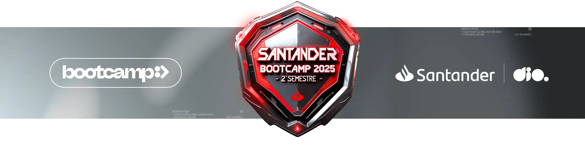

  

# Santander 2025 - Fundamentos de Lógica de Programação em JavaScript

Bootcamp em parceria com a plataforma DIO

## 📚 Sobre o Bootcamp

Este repositório contém os projetos e exercícios desenvolvidos durante o bootcamp de Fundamentos de Lógica de Programação em JavaScript, realizado através da parceria entre Santander e DIO.

## 🚀 Projetos

### Classificador de Nível de Herói
Sistema de classificação baseado em experiência (XP)

## 🛠️ Tecnologias

- JavaScript
- Node.js

## 👨‍💻 Autor

**JACursino**

---

⭐ Desenvolvido durante o Bootcamp Santander 2025 - DIO
