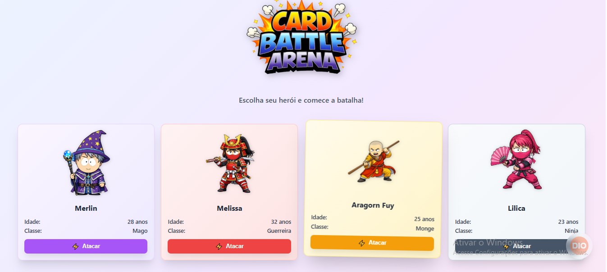

# 🎮 Card Battle Arena

Jogo interativo de batalha entre heróis desenvolvido como parte do desafio da **Digital Innovation One (DIO)**.

## 🎯 Sobre o Projeto

Este projeto foi desenvolvido como resposta ao **Desafio #3 - Escrevendo as classes de um Jogo** da DIO, com o objetivo de aplicar conceitos fundamentais de programação orientada a objetos como:

* ✅ Variáveis
* ✅ Operadores
* ✅ Laços de repetição
* ✅ Estruturas de decisão (if/else)
* ✅ Funções
* ✅ Classes e Objetos

O desafio básico foi expandido com uma interface web completa, transformando um exercício de console em uma aplicação visual interativa e profissional.

---

## ✨ Funcionalidades

### Funcionalidades Básicas (Desafio Original)

* ✅ Classe `Heroi` com propriedades nome, idade e tipo
* ✅ Método `atacar()` que exibe mensagem personalizada
* ✅ 4 tipos de heróis (Mago, Guerreiro, Monge, Ninja)
* ✅ Ataques específicos por tipo de herói
* ✅ Uso de estruturas condicionais para determinar ataque

### Funcionalidades Avançadas (Implementadas)

* 🎨 Interface web completa com design moderno
* 🃏 Cards interativos de personagens estilo South Park
* ⚡ Animações e efeitos visuais (shake, hover, fade)
* 📊 Sistema de log de batalha em tempo real
* 🎯 Batalha individual e em grupo
* 🕐 Timestamp em cada ataque registrado
* 🔢 Contador total de ataques
* 🗑️ Botão para limpar histórico de batalhas
* 📱 Design responsivo (funciona em mobile)
* 💡 Info box sobre o projeto (DIO)
* 🎨 Gradientes e cores temáticas por personagem

---

## 🚀 Tecnologias Utilizadas

### Versão Web (Principal)
* **HTML5** - Estrutura semântica
* **CSS3** - Estilização avançada
  * Grid & Flexbox Layout
  * Animations & Transitions
  * Gradient & Drop-shadow Effects
* **JavaScript ES6+** - Lógica e POO
  * Classes
  * Arrow Functions
  * Template Literals
  * DOM Manipulation

### Versão Terminal (Básica)
* **Node.js** - Ambiente de execução JavaScript

---

## 📂 Estrutura do Projeto
```
card-battle-arena/
│
├── README.md                    # README principal (completo)
│
├── /versao-web/                 # Versão web
│   ├── index.html
│   ├── style.css
│   ├── script.js
│   └── /imagens/
│       ├── logo.png
│       ├── mago.png
│       ├── guerreira.png
│       ├── monge.png
│       └── ninjam.png
│
└── /versao-terminal/            # Versão terminal
    └── index.js
---

## 🎮 Como Usar

### Versão Web

1. Clone o repositório:
```bash
git clone https://github.com/seu-usuario/card-battle-arena.git
cd card-battle-arena
```

2. Abra o arquivo `index.html` no navegador:
   * Duplo clique no arquivo, ou
   * Use Live Server (VS Code)

3. Interaja com a aplicação:
   * Clique em **"Atacar"** em cada card para ataque individual
   * Use **"Batalha em Grupo"** para todos atacarem em sequência
   * Acompanhe o histórico no **Log de Batalha**
   * Clique em **"Limpar Log"** para resetar o histórico

### Versão Terminal
```bash
cd versao-terminal
node index.js
```

---

## 🏆 Sistema de Heróis

O jogo possui 4 tipos de heróis, cada um com ataque específico:

| Tipo | Ataque | Ícone | Mensagem |
|------|--------|-------|----------|
| 🔮 Mago | Magia | ✨ | "O herói Mago atacou usando magia" |
| ⚔️ Guerreira | Espada | 🗡️ | "A heroína Guerreira atacou usando espada" |
| 🥋 Monge | Artes Marciais | 🥋 | "O herói Monge atacou usando artes marciais" |
| 🥷 Ninja | Shuriken | 💥 | "O herói Ninja atacou usando shuriken" |

---

## 📸 Demonstração

### Interface Principal


### Log de Batalha
Cada ataque é registrado com:
* ✨ Ícone do tipo de ataque
* 📝 Mensagem personalizada
* 🕐 Timestamp do momento do ataque
* 🎨 Cor de fundo correspondente ao herói

---

## 🎨 Melhorias Implementadas

### 1. Programação Orientada a Objetos
```javascript
class Heroi {
    constructor(nome, idade, tipo, imagem) {
        this.nome = nome;
        this.idade = idade;
        this.tipo = tipo;
        this.imagem = imagem;
    }

    atacar() {
        const ataques = {
            "Mago": { ataque: "magia", icone: "✨" },
            "Guerreira": { ataque: "espada", icone: "🗡️" },
            "Monge": { ataque: "artes marciais", icone: "🥋" },
            "Ninja": { ataque: "shuriken", icone: "💥" }
        };

        const info = ataques[this.tipo];
        const artigo = this.tipo === "Guerreira" ? "A heroína" : "O herói";
        return `${info.icone} ${artigo} ${this.tipo} atacou usando ${info.ataque}`;
    }
}
```

### 2. Interface Dinâmica

O sistema gera cards dinamicamente usando JavaScript:
```javascript
function renderCards() {
    herois.forEach((heroi, index) => {
        const card = document.createElement('div');
        card.className = `hero-card ${heroi.tipo.toLowerCase()}`;
        card.innerHTML = `
            <div class="hero-icon">
                
            </div>
            <div class="hero-name">${heroi.nome}</div>
            // ... resto do card
        `;
        cardsGrid.appendChild(card);
    });
}
```

### 3. Sistema de Animações
```css
.hero-card.attacking {
    animation: shake 0.5s ease-in-out;
}

@keyframes shake {
    0%, 100% { transform: translateX(0) rotate(0deg); }
    10%, 30%, 50%, 70%, 90% { transform: translateX(-4px) rotate(-2deg); }
    20%, 40%, 60%, 80% { transform: translateX(4px) rotate(2deg); }
}
```

### 4. Log de Batalha Inteligente

* Cores temáticas por tipo de herói
* Ordenação cronológica (mais recente primeiro)
* Scroll automático para novos registros
* Contador dinâmico de ataques totais

---

## 📚 Aprendizados

Durante o desenvolvimento deste projeto, foram aplicados e aprofundados os seguintes conceitos:

### Conceitos de Programação

* ✅ Classes e Objetos (POO)
* ✅ Métodos e propriedades de instância
* ✅ Estruturas condicionais com objetos literais
* ✅ Arrow functions e template literals
* ✅ Manipulação do DOM
* ✅ Event listeners e callbacks
* ✅ SetTimeout para animações sequenciais
* ✅ Array methods (forEach, map, unshift)

### Boas Práticas

* ✅ Separação de responsabilidades (HTML/CSS/JS)
* ✅ Código modular e reutilizável
* ✅ Nomenclatura descritiva e semântica
* ✅ Organização de arquivos e assets
* ✅ Comentários explicativos
* ✅ Design responsivo
* ✅ Acessibilidade (alt em imagens, estrutura semântica)

### Design e UX

* ✅ Feedback visual imediato (animações)
* ✅ Hierarquia visual clara
* ✅ Cores temáticas consistentes
* ✅ Micro-interações agradáveis
* ✅ Estados hover e active
* ✅ Layout intuitivo e organizado

---

## 🔄 Versões do Projeto

### 🌐 Versão Web (Atual)
**Arquivos:** `index.html`, `style.css`, `script.js`

Interface gráfica completa com cards interativos, animações e sistema de log visual.

### 💻 Versão Terminal (Básica)
**Arquivo:** `versao-terminal/index.js`

Implementação minimalista focada em lógica e POO, com saída formatada no console.

**Exemplo de saída:**
```
=== INFORMAÇÕES DOS HERÓIS ===

🔮  Nome:  Merlin
    Idade:  28
    Tipo:  Mago
------------------

=== ATAQUES ===

✨ O herói Mago atacou usando magia
🗡️ A heroína Guerreira atacou usando espada
🥋 O herói Monge atacou usando artes marciais
💥 O herói Ninja atacou usando shuriken
```

---

## 🙏 Agradecimentos

* **[Digital Innovation One (DIO)](https://www.dio.me/)** pelo desafio proposto
* **Santander** pelo patrocínio do bootcamp
* Comunidade de desenvolvedores da DIO

---

## 📄 Licença

Este projeto foi desenvolvido para fins educacionais como parte do Bootcamp Santander 2025.

---

## 👨‍💻 Autor

**[Seu Nome]**

[](https://linkedin.com/in/seu-perfil)
[](https://github.com/seu-usuario)
[](https://www.dio.me/users/seu-usuario)

---

<div align="center">

**Bootcamp:** Santander 2025
**Plataforma:** Digital Innovation One
**Desafio:** #3 - Escrevendo as classes de um Jogo

⭐ **Se este projeto te ajudou, considere dar uma estrela!**

</div>
